# Interact Ai 跨客戶資料庫語意查詢實作手冊

Status: implementation specification
Owner systems: Interact Vision 主站台 / Company Portal + Interact WebUI
Primary runtime: Interact WebUI backend
Supported databases: PostgreSQL, MySQL/MariaDB, Microsoft SQL Server, SQLite
UX baseline: Nielsen Norman Group 10 Usability Heuristics
Last reviewed: 2026-07-12

## 0. 文件用途

這份文件是工程實作規格，不是概念提案。後續開發若發生上下文遺失，應先閱讀本文件，再閱讀：

- `docs/workflow-channel-development-handbook.md`
- `backend/open_webui/models/interact_data_connectors.py`
- `backend/open_webui/tools/interact_database.py`
- `backend/open_webui/routers/interact_channels.py`
- `src/routes/(app)/workspace/data-connectors/+page.svelte`

本文件解決的核心問題是：

> 每個客戶的資料庫 table、column、relation 與商業定義都不同，Agent 如何在不猜 schema、不跨公司、不繞過 ACL、不執行任意 SQL 的前提下，正確回答跨表、聚合、排名與期間比較問題？

最終答案不是讓 LLM 直接產生 SQL，而是：

1. 系統掃描客戶 schema。
2. 管理員建立並發布企業資料語意模型。
3. Agent 只產生受限制的 Query Plan。
4. WebUI backend 驗證 tenant、ACL、relationship、row policy 與成本。
5. DB adapter 將 Query Plan 編譯為參數化唯讀 SQL。
6. 執行結果經遮罩、稽核與一致格式後才交給 Agent。

## 1. 不可違反的設計決策

以下規則視為 architecture invariants，除非另開 ADR 並完成安全審查，不得在實作中弱化。

1. LLM 不得提交 raw SQL。
2. Query Plan 不得接受任意 table name、column name 或 join expression；只能引用已發布的 semantic IDs。
3. 所有可用 relationship 必須由管理員確認或由已確認規則產生。
4. 每次查詢必須帶入 server-side tenant context，不能信任模型提供 company ID。
5. Connector ACL、dataset ACL、field ACL、row policy 必須全部通過，缺一即拒絕。
6. 預設唯讀。即使 connector 設定 `allow_write=true`，語意查詢 runtime 仍不得執行寫入。
7. 不以 LLM 記憶或 prompt 當權限控制。
8. Schema snapshot、semantic model 與 metric 都必須版本化。
9. 已發布版本不可原地修改；修改後建立新版本。
10. Schema drift 影響到已發布模型時，受影響模型必須進入 `degraded` 或 `blocked`，不能默默猜測替代欄位。
11. 查詢結果只能包含 policy 允許的欄位，錯誤訊息不得洩漏密碼、connection string 或未授權 schema。
12. LINE、Telegram、WeChat、WebUI chat、workflow 與 API 必須共用同一個 query authorization path。

## 2. 現有系統基線與缺口

### 2.1 可以沿用的能力

目前 WebUI 已有：

- `InteractDataConnector`
  - company ownership
  - encrypted credentials
  - connector enabled state
  - allowed/blocked schemas, tables, columns
  - member/group/model/channel ACL configuration fields
  - row limit and timeout
- `QueryContext`
  - user ID and role
  - model ID
  - channel ID/source
  - company user/member identity
- DB adapters
  - PostgreSQL
  - MySQL/MariaDB
  - MSSQL
  - SQLite
- Schema scanner
  - table/view metadata
  - columns and types
  - primary keys
  - foreign keys where database supports them
- Query audit event
  - connector, user, model, channel, table, status, row count, error
- Agent builtin tools
  - `interact_database_schema`
  - `interact_database_query`
- Channel runtime
  - trusted service-token channel execution
  - company/model/channel context propagation

### 2.2 現有能力不能解決的問題

目前 `interact_database_query`：

- 一次只接受一個 table/view。
- `select` 只能選欄位、filter、order、limit。
- `count` 只能 `COUNT(*)` 與簡單 `group_by`。
- 不支援 JOIN、SUM、AVG、COUNT DISTINCT、計算欄位、時間粒度或 window function。
- Agent 可連續查多張表，但只能在模型上下文內自行拼接，無法保證完整性與數值正確性。
- Query audit 沒有 query plan、semantic version、duration、scanned rows、policy decision 或 result checksum。
- Schema scan 結果未持久化成版本。
- 管理 UI 沒有 data catalog、relationship、dataset、metric、row policy 或 query playground。
- `allowed_group_ids` 目前有保存欄位，但 `QueryContext` 沒有 group IDs，執行期 policy 尚未真正檢查 group ACL；不能把「已保存」誤認為「已授權生效」。
- `allowed_columns` 為空時，legacy query 會把未 blocked 的可見欄位視為可讀；新 semantic catalog 必須改成 `readable=false` 的 deny-by-default。

現有工具保留作為 legacy/simple lookup，不再擴充成 raw SQL 接口。新的聚合與跨表能力以 semantic query runtime 實作。

## 3. 系統邊界

### 3.1 主站台 / Company Portal

主站台負責商業與企業治理：

- Connector 建立入口與企業身份。
- 方案限制，例如 connector 數量、每日查詢量、semantic model 數量。
- 公司 owner/admin 與 member/group 管理。
- 模型、channel、workflow 授權入口。
- 高階使用量、失敗率與費用摘要。
- WebUI deep link 與 SSO。

主站台不得：

- 保存可解密的 DB password。
- 直接連線客戶 DB。
- 編譯或執行 SQL。
- 直接相信瀏覽器傳來的 company/member role。

### 3.2 WebUI

WebUI 負責資料平面與 runtime：

- 加密保存 connector credentials。
- Schema scan 與 snapshot。
- Data catalog、relationship、dataset、metric、row policy。
- Query Plan validation、compile、execute。
- Agent tools。
- Workflow database node。
- Channel query runtime。
- Query audit、debug trace 與 result delivery。

### 3.3 信任邊界

```mermaid
flowchart LR
    User["Company user / Channel user"] --> Site["Company Portal"]
    Site -->|"signed service request"| WebUI["WebUI control API"]
    Agent["LLM / Agent"] -->|"semantic IDs only"| Planner["Query Plan validator"]
    WebUI --> Planner
    Planner --> Policy["Tenant + ACL + RLS + cost policy"]
    Policy --> Compiler["DB-specific compiler"]
    Compiler -->|"parameterized read-only SQL"| CustomerDB["Customer database"]
    CustomerDB --> Redactor["Result limiter / redactor"]
    Redactor --> Agent
```



## 4. 名詞與物件關係

- **Connector**: 一個實際 DB 連線及其 company/model/channel/member ACL。
- **Schema Snapshot**: 某時間點掃描到的 DB 結構，immutable。
- **Catalog Object**: 被允許建模的 table/view 與 column 描述。
- **Relationship**: 兩個 catalog object 間可用的 join path。
- **Dataset**: 可被 Agent 查詢的業務資料集，例如「銷售績效」。
- **Dimension**: 分組或篩選欄位，例如業務、區域、月份。
- **Measure**: 可聚合的數值，例如成交金額、商機數。
- **Metric**: 有商業意義的公式，例如銷售額、達成率、轉換率。
- **Row Policy**: 根據當前 member/channel 等 context 強制加入的資料列限制。
- **Query Plan**: Agent 產生的受限 JSON DSL。
- **Compiled Query**: backend 根據 Query Plan 產生的參數化 SQL。

## 5. 資料模型

正式環境使用 Alembic migration 建表，不再只依賴 runtime `create_all()`。所有表以 `company_user_id` 或可追溯到 company 的 foreign key 作 tenant partition key。

### 5.1 `interact_schema_snapshot`

```text
id                    text primary key
connector_id          text not null index
company_user_id       text not null index
version               integer not null
status                text: scanning, ready, failed, superseded
fingerprint           text not null
scanner_version       text not null
database_product      text not null
database_version      text nullable
schema_json           text not null
error_code            text nullable
error_detail          text nullable
created_by            text not null
created_at            bigint not null
completed_at          bigint nullable
unique(connector_id, version)
unique(connector_id, fingerprint)
```

`fingerprint` 使用 canonical schema JSON 的 SHA-256。Canonicalization 必須排序 schema/table/column/FK，排除 scan timestamp。

### 5.2 `interact_catalog_object`

```text
id                    text primary key
company_user_id       text not null index
connector_id          text not null index
snapshot_id           text not null
physical_name         text not null
object_type           text: table, view
display_name          text not null
description           text nullable
synonyms_json         text not null default []
business_domain       text nullable
sensitivity           text: public, internal, confidential, restricted
enabled               boolean not null default false
source_verified       boolean not null default false
updated_by            text not null
updated_at            bigint not null
unique(snapshot_id, physical_name)
```

### 5.3 `interact_catalog_field`

```text
id                    text primary key
catalog_object_id     text not null index
physical_name         text not null
display_name          text not null
description           text nullable
synonyms_json         text not null default []
physical_type         text not null
semantic_type         text: identifier, string, boolean, date, datetime, money, number, percentage, enum, pii
nullable              boolean not null
primary_key           boolean not null default false
readable              boolean not null default false
filterable            boolean not null default false
groupable             boolean not null default false
aggregatable          boolean not null default false
default_aggregation   text nullable
sensitivity           text not null
masking_rule          text: none, redact, partial, hash, last4
sample_values_json    text nullable
updated_by            text not null
updated_at            bigint not null
unique(catalog_object_id, physical_name)
```

`sample_values_json` 預設不得收集。只有管理員明確啟用、欄位不是 restricted/PII、且最多取 10 個 distinct values 時才可保存。

### 5.4 `interact_catalog_relationship`

```text
id                    text primary key
company_user_id       text not null index
connector_id          text not null index
left_object_id        text not null
right_object_id       text not null
relationship_type     text: one_to_one, one_to_many, many_to_one, many_to_many
join_type             text: inner, left
join_pairs_json       text not null
source                text: foreign_key, admin_defined
status                text: suggested, confirmed, rejected, broken
fanout_risk           text: none, low, high
description           text nullable
confirmed_by          text nullable
updated_at            bigint not null
```

`join_pairs_json` 範例：

```json
[
	{
		"leftFieldId": "orders.salesperson_id",
		"rightFieldId": "employees.id"
	}
]
```

禁止保存 raw join SQL。Composite key 以多個 field pair 表達。

### 5.5 `interact_semantic_dataset`

```text
id                    text primary key
company_user_id       text not null index
connector_id          text not null index
slug                  text not null
name                  text not null
description           text not null
business_domain       text nullable
status                text: draft, published, degraded, blocked, archived
current_version_id    text nullable
access_mode           text: company_admins, selected_members, all_company_members, selected_channels
allowed_member_ids    text not null default []
allowed_group_ids     text not null default []
allowed_model_ids     text not null default []
allowed_channel_ids   text not null default []
allowed_workflow_ids  text not null default []
created_by            text not null
created_at            bigint not null
updated_at            bigint not null
unique(company_user_id, slug)
```

### 5.6 `interact_semantic_dataset_version`

```text
id                    text primary key
dataset_id            text not null index
version               integer not null
snapshot_id           text not null
definition_json       text not null
validation_json       text not null
published_by          text not null
published_at          bigint not null
unique(dataset_id, version)
```

`definition_json` 包含 root object、relationship IDs、dimension、measure、metric 與 default time field。Published version immutable。

### 5.7 `interact_row_policy`

```text
id                    text primary key
company_user_id       text not null index
dataset_id            text not null index
name                  text not null
status                text: draft, active, disabled
principal_type        text: member, group, role, channel
principal_ids_json    text not null
expression_json       text not null
deny_if_unresolved    boolean not null default true
created_by            text not null
updated_at            bigint not null
```

Row policy expression 只能引用 semantic field ID 與可信 context variable：

- `$context.company_member_id`
- `$context.company_member_role`
- `$context.external_user_id`
- `$context.channel_id`
- `$context.user_id`

不能引用 user prompt 提供的身份值。

### 5.8 `interact_semantic_query_event`

```text
id                    text primary key
company_user_id       text not null index
connector_id          text not null index
dataset_id            text nullable index
dataset_version_id    text nullable
user_id               text nullable
company_member_id     text nullable
model_id              text nullable
channel_id            text nullable
workflow_id           text nullable
request_id            text not null index
status                text: planned, denied, compiled, succeeded, failed, timeout
intent_summary        text nullable
plan_json_redacted    text nullable
plan_fingerprint      text nullable
policy_decision_json  text nullable
compiled_query_hash   text nullable
row_count             integer not null default 0
duration_ms           integer nullable
error_code            text nullable
error_detail          text nullable
created_at            bigint not null
```

Audit 不保存完整 SQL literal、password 或 unrestricted result rows。Debug SQL 只在管理員 debug mode 暫存，所有 values 以 placeholders 顯示。

## 6. Schema 掃描與 drift 管理

### 6.1 掃描流程

1. 驗證 connector 屬於當前 company。
2. 驗證 credentials 與 read-only 權限。
3. 建立 `scanning` snapshot。
4. Adapter 讀取 database product/version。
5. 掃描 allowlisted schemas 內的 table/view。
6. 掃描 column type、nullable、default、ordinal。
7. 掃描 PK、unique constraint、FK、index。
8. 標記 DB-specific unsupported metadata。
9. 產生 canonical JSON 與 fingerprint。
10. 若 fingerprint 未變，回傳 `unchanged`，不建立重複 ready version。
11. 若變更，建立新 ready snapshot 並執行 impact analysis。

### 6.2 Adapter 一致輸出

所有 scanner 必須回傳：

```json
{
	"database": {
		"product": "postgresql",
		"version": "16.2"
	},
	"objects": [
		{
			"physicalName": "public.orders",
			"type": "table",
			"columns": [],
			"primaryKey": ["id"],
			"uniqueKeys": [],
			"foreignKeys": [],
			"indexes": []
		}
	],
	"capabilities": {
		"foreignKeys": true,
		"explain": true,
		"statementTimeout": true
	}
}
```

### 6.3 Drift 分類

- **safe**: 新增未使用的 table/column。
- **review**: field type widening、nullable 改變、relationship 新增。
- **breaking**: 已使用 field/table 刪除或改名、type incompatible、FK 移除。

Breaking drift 行為：

1. 將受影響 dataset 標為 `degraded`。
2. 禁止發布新查詢版本。
3. 若缺失欄位是 metric 必要欄位，runtime 直接回 `SEMANTIC-MODEL-DRIFT-BLOCKED`。
4. 管理員 UI 顯示受影響 dataset/metric，不自動替換。

### 6.4 排程

- 建立 connector 後立即掃描。
- 管理員手動掃描。
- 預設每日一次 background scan。
- 連續 3 次 connection failure 後降低頻率，不停用舊 snapshot。
- 查詢前不做完整 scan，避免 latency 不穩。

## 7. Data Catalog 與語意建模

### 7.1 自動建議可以做什麼

系統可根據名稱、型別、PK/FK 提供：

- display name 初稿。
- semantic type 初稿。
- date/money/identifier 候選。
- FK relationship suggestion。
- PII 候選，例如 email、phone、tax ID。

自動建議不得直接發布。管理員必須確認：

- 業務定義。
- 欄位是否可讀/可 filter/group/aggregate。
- sensitive classification。
- join cardinality。
- metric 公式。
- row policy。

### 7.2 Dataset definition 範例

```json
{
	"rootObjectId": "orders",
	"relationshipIds": ["orders_to_employees", "orders_to_customers"],
	"defaultTimeDimensionId": "order.closed_at",
	"dimensions": [
		{
			"id": "salesperson.name",
			"name": "業務人員",
			"fieldId": "employees.name"
		},
		{
			"id": "sales.region",
			"name": "銷售區域",
			"fieldId": "employees.region"
		}
	],
	"measures": [
		{
			"id": "sales.revenue",
			"name": "銷售額",
			"fieldId": "orders.grand_total",
			"aggregation": "sum",
			"filters": [
				{
					"fieldId": "orders.status",
					"operator": "in",
					"value": ["completed"]
				}
			]
		},
		{
			"id": "sales.order_count",
			"name": "成交筆數",
			"fieldId": "orders.id",
			"aggregation": "count_distinct"
		}
	],
	"metrics": [
		{
			"id": "sales.average_order_value",
			"name": "平均客單價",
			"expression": {
				"operator": "divide",
				"leftMeasureId": "sales.revenue",
				"rightMeasureId": "sales.order_count"
			}
		}
	]
}
```

### 7.3 Fanout 防護

所有聚合 query 必須分析 join cardinality。以下情況必須拒絕或自動使用安全 subquery：

- 同時從 root join 兩個 one-to-many branch 後直接 SUM。
- measure 所在 object 經 many-to-many path 被重複。
- COUNT 未指定是否 distinct。
- relationship cardinality 未確認。

Compiler 預設策略：

1. Measure 先在其 grain 內 aggregation。
2. 再將 aggregated subquery join 到 dimension path。
3. `count_distinct` 必須明確指定 entity field。
4. 無法證明 grain 安全時回 `QUERY-FANOUT-RISK`，不得執行。

這條規則可避免現有 `v_employee_activity` 同時 join follow-ups/deals 造成金額倍增的問題。

## 8. Query Plan DSL v1

### 8.1 Agent 可提交的欄位

```json
{
	"version": "1",
	"datasetId": "sales-performance",
	"datasetVersion": 3,
	"measures": ["sales.revenue", "sales.order_count"],
	"metrics": [],
	"dimensions": ["salesperson.name"],
	"filters": {
		"operator": "and",
		"conditions": [
			{
				"fieldId": "sales.region",
				"operator": "eq",
				"value": "North"
			}
		]
	},
	"timeRange": {
		"dimensionId": "sales.closed_at",
		"preset": "this_month",
		"timezone": "Asia/Taipei"
	},
	"timeGrain": null,
	"orderBy": [
		{
			"fieldId": "sales.revenue",
			"direction": "desc"
		}
	],
	"limit": 5,
	"includeTotals": false
}
```

### 8.2 Whitelist

Aggregation v1：

- `sum`
- `count`
- `count_distinct`
- `avg`
- `min`
- `max`

Filter v1：

- `eq`, `ne`
- `gt`, `gte`, `lt`, `lte`
- `in`, `not_in`
- `contains`, `starts_with`
- `is_null`, `is_not_null`
- `between`

Time preset v1：

- `today`, `yesterday`
- `this_week`, `last_week`
- `this_month`, `last_month`
- `this_quarter`, `last_quarter`
- `this_year`, `last_year`
- explicit `start` and `end`

Time grain v1：

- `day`, `week`, `month`, `quarter`, `year`

### 8.3 明確禁止

- `sql`
- physical table/column names
- arbitrary function names
- custom join expressions
- subquery supplied by caller
- comments or SQL fragments
- dynamic identifier interpolation
- unbounded limit
- write operation

Pydantic model應使用 `extra='forbid'`，未知欄位直接回 `QUERY-PLAN-INVALID`。

## 9. Query validation pipeline

Validation 必須依固定順序執行，不能因 Agent prompt 或 provider 不同而跳步。

1. 建立 `TrustedQueryContext`。
2. 驗證 user/session 或 trusted channel runtime。
3. 從 billing/company identity service 解析 company/member；忽略 client company ID。
4. 載入 connector 並驗證 enabled/company/model/channel/member ACL。
5. 載入 published dataset/version。
6. 驗證 dataset ACL 與 connector 一致。
7. 驗證 semantic IDs 存在且 enabled。
8. 驗證 field sensitivity 與 caller permission。
9. 將 preset time range 解析為 absolute timestamps。
10. 注入 row policies。
11. 建立 required object graph。
12. 解析唯一、confirmed relationship path。
13. 檢查 fanout/grain。
14. 檢查 aggregation/filter/type compatibility。
15. 估算 query cost。
16. 編譯參數化 SQL。
17. 以 DB read-only mode 與 timeout 執行。
18. 套用 max rows、result bytes、masking。
19. 寫入 audit event。
20. 回傳統一 result contract。

任一步驟失敗都不得 fallback 成 raw SQL 或 legacy unrestricted table query。

外部 LINE、Telegram、WeChat 使用者不等同企業主帳號或企業成員。Runtime 必須帶入伺服器產生的
`externalUserId`，而且只有 dataset 設為 `selected_channels`、connector 與 dataset 的
`allowed_channel_ids` 都明確包含目前 channel 時才可查詢。對外部渠道而言，空 channel 清單代表拒絕，
不得解讀為不限渠道；`company_admins`、`selected_members`、`all_company_members` 均不得被外部使用者繼承。

## 10. Cost guard 與執行限制

每個 connector 新增：

```text
max_result_rows             default 100
max_result_bytes            default 1 MB
max_query_seconds           default 15
max_join_count              default 5
max_group_cardinality       default 500
max_estimated_scan_rows     default 1,000,000
allow_explain               default true
require_time_filter_days    nullable
```

執行前：

- PostgreSQL 使用 `EXPLAIN (FORMAT JSON)`，禁止 `ANALYZE`。
- MySQL 使用 `EXPLAIN FORMAT=JSON`，不支援時採保守規則。
- MSSQL 使用 estimated plan 或 metadata-based guard；不得執行實際 plan。
- SQLite 只允許本機 private node，採 join/limit 規則與 progress handler timeout。

若 estimate 不可靠且 query 無 time filter、涉及大表 aggregation，回 `QUERY-COST-REVIEW-REQUIRED`。

## 11. SQL compiler

新增 package：

```text
backend/open_webui/semantic_query/
  contracts.py
  context.py
  catalog.py
  planner.py
  policy.py
  fanout.py
  result.py
  errors.py
  audit.py
  compilers/
    base.py
    postgres.py
    mysql.py
    mssql.py
    sqlite.py
```

Compiler interface：

```python
class SemanticQueryCompiler(Protocol):
    def compile(
        self,
        plan: ValidatedQueryPlan,
        model: PublishedSemanticModel,
        policies: list[ResolvedRowPolicy],
    ) -> CompiledQuery: ...
```

`CompiledQuery`：

```text
sql                 string with placeholders
parameters          ordered list/dict
selected_fields     result field metadata
query_hash          SHA-256 of normalized SQL structure
estimated_cost      normalized cost object
```

DB-specific differences集中在 compiler：

- identifier quoting
- placeholder style
- date truncation
- timezone conversion
- boolean literal
- string contains
- limit/top syntax
- statement timeout

Business metric definition不得包含 DB-specific SQL。

## 12. Agent 工具與較弱模型相容性

### 12.1 新工具

新增兩個 builtin tools：

1. `interact_semantic_catalog`
   - 回傳 caller 可用的 datasets、dimensions、measures、metrics。
   - 不回 physical table/column，除非管理 debug mode。
2. `interact_semantic_query`
   - 接受 Query Plan DSL。
   - 後端做完整 validation/compile/execute。

Legacy `interact_database_query`：

- 保留給明確單表 lookup。
- Tool description 應寫明不適合跨表聚合與排名。
- 當 semantic dataset 可回答時，Agent system policy 優先 semantic tool。

### 12.2 Agent 決策順序

1. 判斷問題是否需要企業資料。
2. 若不需要，不呼叫 DB 工具。
3. 呼叫 semantic catalog 或使用 request 內已注入的精簡 catalog manifest。
4. 找唯一 dataset/metric。
5. 有歧義時先問一個業務問題，例如「銷售額是訂單金額或已收款金額？」
6. 產生 Query Plan。
7. 工具驗證失敗時依 error code 修正一次。
8. 同一 error code 連續兩次不得重試，改向使用者說明或要求管理員設定。

### 12.3 給 MiniMax 等較弱模型的措施

- Catalog manifest 最多顯示 top 10 relevant datasets。
- 每個 dataset 提供 3 至 8 個 example questions。
- 使用 enum 和 semantic IDs，不讓模型拼 physical identifiers。
- Query Plan schema 不使用多型 union 的複雜巢狀格式。
- 後端可先用 deterministic keyword/embedding retrieval 選 dataset，再讓 LLM 填 plan。
- Time preset、排序、limit 由 rule-based normalizer 補齊。
- Validator 回傳 machine-readable `fieldPath`、`expected`、`allowedValues`。
- 禁止模型看到其他 company catalog。

### 12.4 Dataset selector

Selector score：

```text
score =
  0.35 * name/synonym lexical match
  0.30 * embedding similarity
  0.15 * metric/dimension coverage
  0.10 * example-question similarity
  0.10 * channel/model policy eligibility
```

- score >= 0.78 且領先第二名 >= 0.12：自動選擇。
- score 0.58 至 0.78：LLM rerank top 3。
- 仍無唯一答案：向使用者澄清。
- score < 0.58：不查詢，回 `DATASET-NOT-MATCHED`。

閾值需透過真實 query evaluation set 校正，不以直覺永久固定。

## 13. 統一結果 contract

```json
{
	"ok": true,
	"requestId": "...",
	"dataset": {
		"id": "sales-performance",
		"name": "銷售績效",
		"version": 3
	},
	"querySummary": {
		"dimensions": ["業務人員"],
		"measures": ["銷售額"],
		"timeRange": {
			"start": "2026-07-01T00:00:00+08:00",
			"end": "2026-08-01T00:00:00+08:00",
			"label": "本月"
		},
		"filters": []
	},
	"columns": [
		{
			"id": "salesperson.name",
			"label": "業務人員",
			"type": "string"
		},
		{
			"id": "sales.revenue",
			"label": "銷售額",
			"type": "money",
			"currency": "TWD"
		}
	],
	"rows": [
		{
			"salesperson.name": "王小明",
			"sales.revenue": 1250000
		}
	],
	"rowCount": 5,
	"truncated": false,
	"freshness": {
		"queriedAt": "2026-07-12T10:00:00+08:00",
		"schemaSnapshotAt": "2026-07-12T02:00:00+08:00"
	},
	"warnings": []
}
```

Agent 回答必須說明：

- 使用哪個 dataset/metric。
- 時間範圍與 timezone。
- 是否 truncated。
- 若有 warning，不可隱藏。

## 14. 錯誤碼

### 14.1 Connector/context

- `DB-COMPANY-CONTEXT-MISSING`
- `DB-CONNECTOR-NOT-CONFIGURED`
- `DB-CONNECTOR-DISABLED`
- `DB-MODEL-NOT-ALLOWED`
- `DB-CHANNEL-NOT-ALLOWED`
- `DB-USER-NOT-ALLOWED`
- `DB-CONNECTION-FAILED`
- `DB-AUTHENTICATION-FAILED`
- `DB-TIMEOUT`

### 14.2 Catalog/model

- `SCHEMA-SNAPSHOT-NOT-READY`
- `SEMANTIC-DATASET-NOT-FOUND`
- `SEMANTIC-DATASET-NOT-PUBLISHED`
- `SEMANTIC-DATASET-NOT-ALLOWED`
- `SEMANTIC-FIELD-NOT-ALLOWED`
- `SEMANTIC-RELATIONSHIP-MISSING`
- `SEMANTIC-RELATIONSHIP-AMBIGUOUS`
- `SEMANTIC-MODEL-DRIFT-BLOCKED`
- `ROW-POLICY-CONTEXT-MISSING`

### 14.3 Query

- `QUERY-PLAN-INVALID`
- `QUERY-TYPE-MISMATCH`
- `QUERY-FANOUT-RISK`
- `QUERY-COST-LIMIT`
- `QUERY-COST-REVIEW-REQUIRED`
- `QUERY-RESULT-LIMIT`
- `QUERY-COMPILATION-FAILED`
- `QUERY-EXECUTION-FAILED`

錯誤 response：

```json
{
	"ok": false,
	"error": {
		"code": "SEMANTIC-RELATIONSHIP-MISSING",
		"message": "銷售資料與員工資料尚未設定可用關聯。",
		"fieldPath": "dimensions[0]",
		"retryable": false,
		"adminAction": "請在資料模型的關聯頁確認 orders.salesperson_id 與 employees.id。",
		"requestId": "..."
	}
}
```

LINE 等 channel 只顯示安全 message + error code；詳細 diagnostics 留在管理員 audit。

## 15. API 規格

所有管理 API 需要 company owner/admin；runtime API 不接受 client-supplied company authority。

### 15.1 Schema

```text
POST /api/v1/interact/data-connectors/{id}/schema-scans
GET  /api/v1/interact/data-connectors/{id}/schema-snapshots
GET  /api/v1/interact/data-connectors/{id}/schema-snapshots/{snapshotId}
GET  /api/v1/interact/data-connectors/{id}/schema-diff?from=&to=
```

### 15.2 Catalog

```text
GET   /api/v1/interact/data-connectors/{id}/catalog
PATCH /api/v1/interact/catalog/objects/{objectId}
PATCH /api/v1/interact/catalog/fields/{fieldId}
POST  /api/v1/interact/data-connectors/{id}/catalog/permission-changes
POST  /api/v1/interact/catalog/relationships
PATCH /api/v1/interact/catalog/relationships/{id}
```

### 15.3 Dataset

```text
GET    /api/v1/interact/semantic-datasets
POST   /api/v1/interact/semantic-datasets
GET    /api/v1/interact/data-connectors/{connector_id}/semantic-datasets/ai-schema-handoff
POST   /api/v1/interact/data-connectors/{connector_id}/semantic-datasets/import
GET    /api/v1/interact/semantic-datasets/{id}
PATCH  /api/v1/interact/semantic-datasets/{id}
POST   /api/v1/interact/semantic-datasets/{id}/validate
POST   /api/v1/interact/semantic-datasets/{id}/publish
GET    /api/v1/interact/semantic-datasets/{id}/versions
POST   /api/v1/interact/semantic-datasets/{id}/test-query
```

### 15.4 Runtime

```text
POST /api/v1/interact/semantic-query/catalog-search
POST /api/v1/interact/semantic-query/plan/validate
POST /api/v1/interact/semantic-query/execute
GET  /api/v1/interact/semantic-query/events
GET  /api/v1/interact/semantic-query/events/{requestId}
```

`test-query` 使用 admin context，但仍執行 connector/table/column policy。可選 `simulateMemberId` 只能由 owner/admin 使用，audit 必須記錄 impersonation。

## 16. Company Portal UX

Company Portal `/company-portal/data-connectors` 應是治理入口，採以下資訊架構：

1. **連線**
   - 連線狀態、最後成功時間、credential replacement。
2. **資料範圍**
   - schemas/tables/columns allowlist。
3. **使用權限**
   - members/groups/models/channels/workflows。
4. **資料模型**
   - deep link 到 WebUI catalog/dataset builder。
5. **健康與用量**
   - query success rate、timeouts、denials、token/query usage。

Portal 不顯示可解密 password。Token/password 欄位只支援 replace，不支援 reveal。

## 17. WebUI UX

取代目前單一 credential form，路由建議：

```text
/workspace/data-connectors
/workspace/data-connectors/{id}/connection
/workspace/data-connectors/{id}/schema
/workspace/data-connectors/{id}/catalog
/workspace/data-connectors/{id}/relationships
/workspace/data-connectors/{id}/datasets
/workspace/data-connectors/{id}/policies
/workspace/data-connectors/{id}/query-lab
/workspace/data-connectors/{id}/activity
```

### 17.1 Connector list

每列顯示：

- connector name/type
- enabled/disabled
- connection health
- schema state: current/drift/error
- published dataset count
- last successful query
- affected model/channel count

### 17.2 Schema/Catalog

- 左欄：搜尋與 object tree。
- 中欄：field table，可 inline 設定 display name、semantic type、read/filter/group/aggregate。
- 右欄：選中 field inspector、sensitivity、masking、references。
- Bulk action 必須顯示影響筆數並可 undo draft changes。
- 不使用 nested cards；以 table、split pane、drawer 為主。

### 17.3 Relationship graph

- 只顯示 selected dataset 相關 object，避免全 DB graph 無法閱讀。
- FK suggestions 使用虛線，confirmed 使用實線，broken 使用紅色。
- Edge inspector 顯示 join pairs、cardinality、fanout warning。
- Publish 前若有 unconfirmed relationship，Validate 必須阻擋。

### 17.4 Dataset builder

步驟不是不可返回的 wizard，而是可自由切換的 tabs：

1. 基本資訊
2. 資料來源與關聯
3. Dimensions
4. Measures/Metrics
5. Row policies
6. Examples
7. Validate/Publish

固定 top bar 顯示：draft/published、unsaved、validate、save、publish。離開有 unsaved guard。

### 17.5 Query Lab

提供兩種 mode：

- Natural language: 模擬 Agent 選 dataset 與 plan。
- Query Plan: JSON editor + form view。

結果區顯示：

- generated semantic plan
- selected dataset/version
- policy checks
- join path
- estimated cost
- result table
- duration/rows/truncated
- sanitized SQL preview for admins

Query Lab 不預設執行；先 Validate，使用者再按 Run。

## 18. Nielsen Norman Group 10 Heuristics 落地檢查

1. **Visibility of system status**
   - scan、validate、publish、query 都有明確狀態與 timestamp。
2. **Match between system and real world**
   - UI 使用「訂單、銷售額、業務」等 business labels，不要求一般管理員理解 SQL。
3. **User control and freedom**
   - draft 可撤銷、取消 scan、離開提示、published version 可 rollback。
4. **Consistency and standards**
   - 與 workflow editor 共用 save/validate/publish/run history pattern。
5. **Error prevention**
   - relationship/fanout/drift/policy 在執行前阻擋。
6. **Recognition rather than recall**
   - 顯示可選 dimensions/measures，不要求記 semantic IDs。
7. **Flexibility and efficiency**
   - 搜尋、bulk edit、template metric、keyboard navigation。
8. **Aesthetic and minimalist design**
   - 預設只顯示相關 schema，不把 500 tables 同時放在 graph。
9. **Help users recognize and recover from errors**
   - error code + 原因 + admin action + affected object。
10. **Help and documentation**

- 每個 metric 顯示定義、資料來源、時間欄位、example questions。

## 19. Workflow 與 channel 整合

### 19.1 Workflow node

新增 `semantic_query` node：

```json
{
	"type": "semantic_query",
	"data": {
		"datasetId": "sales-performance",
		"versionMode": "published",
		"planTemplate": {},
		"inputBindings": {},
		"outputMode": "rows"
	}
}
```

規則：

- Workflow publish 時驗證 dataset ACL/version。
- Run 時再次驗證，不信任 publish 時結果。
- Workflow company 與 dataset company 必須相同。
- Shared template clone 不攜帶 connector/dataset binding；安裝者必須重新綁定。
- Channel 執行同時檢查 workflow ACL、dataset ACL、connector channel ACL。

### 19.2 多媒體結果

Query result 本身是 structured rows。Workflow 可接：

- table formatter
- chart renderer
- CSV/XLSX exporter
- narrative LLM
- LINE flex message adapter
- Telegram document/photo adapter

任何 exporter 仍需遵守 sensitivity/masking，不能以匯出繞過 row/column policy。

## 20. Security checklist

### 20.1 Credentials/network

- 使用 read-only DB account。
- SaaS 預設禁止 localhost/private/link-local target，除非 private deployment 明確允許。
- 阻擋 WebUI 自己的 internal database target。
- TLS 預設 `require`，例外需 UI warning。
- Secret encrypted at rest，API 不回原值。

### 20.2 Query

- 所有 identifiers 來自 server catalog。
- 所有 values parameterized。
- DB session 設 read-only transaction。
- Statement timeout。
- 單 statement；拒絕 semicolon/multiple statements at compiler invariant test。
- 不允許 DDL/DML/function side effects。
- Result bytes/rows cap。
- PII masking after DB result and before audit/LLM。

### 20.3 Tenant isolation

每層 query 都包含 company constraint：

- connector lookup
- snapshot/catalog lookup
- dataset lookup
- policy lookup
- query event lookup

禁止只使用 globally unique ID 後假設安全。Service API 也必須驗證 resource company 與 signed company identity 一致。

### 20.4 Row policy

- Unresolved context 預設 deny。
- Channel external user 與 company member mapping 未建立時，不得自動當 company member。
- Admin bypass 必須 explicit endpoint + audit，不得在一般 Agent runtime 自動 bypass。
- Row policy injection 完成後才做 cost estimate 與 compile。

## 21. Observability

### 21.1 Metrics

- `semantic_query_requests_total{status,database,dataset}`
- `semantic_query_duration_ms`
- `semantic_query_rows_returned`
- `semantic_query_denials_total{code}`
- `semantic_query_timeouts_total`
- `semantic_query_cost_rejections_total`
- `schema_scan_duration_ms`
- `schema_drift_objects_total{severity}`
- `dataset_selector_accuracy`
- `query_plan_validation_failures{field}`

Metric labels 不得包含 company email、SQL、prompt 或 column values。

### 21.2 Correlation

同一 request ID 必須出現在：

- channel job
- chat message
- workflow run
- semantic query event
- billing usage event
- structured log

### 21.3 管理員活動頁

顯示 request ID、時間、caller、model/channel/workflow、dataset/version、status、duration、rows、error code。Plan 與 SQL 預設折疊，且只有 company admin 可看。

## 22. 測試策略

### 22.1 Unit tests

- Query Plan Pydantic validation。
- Time preset by timezone/DST。
- semantic ID resolution。
- ACL matrix。
- row policy resolution。
- join path uniqueness。
- fanout detection。
- masking。
- error mapping。
- plan/query fingerprint stability。

### 22.2 Compiler golden tests

每個 DB adapter 使用相同 semantic fixture，比對：

- SQL structure
- placeholder style
- parameters
- date grain
- contains/in/between
- sum/count distinct
- group/order/limit
- row policy injection

Golden test 不只 snapshot 字串，還必須 parse 或 assert 無 DML/DDL、多 statement、未參數化 value。

### 22.3 Integration tests

CI 使用 containers：

- PostgreSQL
- MySQL
- SQL Server，若 CI license/runtime 不可用則 nightly
- SQLite temporary DB

Fixture 至少包含：

- employees
- orders
- order_items
- customers
- sales_targets
- follow_ups

測試：

- top 5 sales ranking
- monthly revenue
- target achievement
- count distinct customers
- one-to-many fanout
- two one-to-many branches 必須阻擋或安全 pre-aggregate
- missing relationship
- drift after column removal
- timeout/row/result-byte limit

### 22.4 ACL test matrix

至少覆蓋：

```text
company A member + company A dataset = allow
company A member + company B dataset = deny
allowed model + allowed channel = allow
disallowed model = deny
disallowed channel channel-request = deny
external channel + selected_channels + connector/dataset explicit channel = allow
external channel + empty connector or dataset channel list = deny
external channel + all_company_members = deny
selected member in list = allow
selected member absent = deny
workflow same company + allowed = allow
public workflow template before rebind = deny
row policy context resolved = filtered result
row policy context missing = deny
```

### 22.5 Agent evaluation set

每個 published dataset 至少 30 題：

- 10 direct questions
- 10 paraphrases/typos/口語
- 5 ambiguous questions expected clarification
- 5 out-of-scope questions expected no DB call

記錄：dataset selection accuracy、plan validity、execution correctness、final answer groundedness。MiniMax 類弱模型必須單獨測，不可只用最強模型通過就發布。

### 22.6 E2E

- WebUI chat
- LINE webhook
- Telegram webhook
- Workflow run
- Query Lab
- schema drift recovery
- main site deep link/SSO

E2E 必須驗證 audit correlation，不只檢查畫面文字。

## 23. 分階段實作計畫

### Phase 0: Baseline stabilization

工作：

- 確認 `src/routes/(app)/workspace/data-connectors/+page.svelte` 與 connector error messages 均以 UTF-8 保存，加入 zh-TW 顯示回歸檢查。
- 將 connector 頁的 connection、scan、delete 狀態建立穩定 baseline，後續再拆分子路由。
- 補上 company group identity resolution 與 `allowed_group_ids` runtime enforcement，加入 group allow/deny tests。
- 明確記錄 legacy `allowed_columns=[]` 的 allow-all 行為；semantic catalog 一律 deny-by-default，不靜默沿用。
- 為 current scanner/query 建立 regression tests。
- 將 `interact_data_connector` 建表移入 Alembic migration。
- 保留 legacy API compatibility。

驗收：

- Existing single-table query、LINE、workflow tests 全通過。
- UI zh-TW 無亂碼。
- Connector CRUD 不遺失 encrypted credentials。

### Phase 1: Persisted schema snapshots and catalog

Backend：

- 新增 snapshot/catalog models、repository、migration。
- 重構四個 scanner 輸出 unified contract。
- 加 fingerprint、diff、impact service。
- 加 schema APIs 與 audit。

Frontend：

- schema tree、scan status、diff view。
- catalog field editor、sensitivity、masking。

驗收：

- 四種 DB 同 fixture schema 結構一致。
- unchanged scan 不產生重複 version。
- breaking drift 可列出 affected fields。

### Phase 2: Relationships and semantic datasets

Backend：

- relationship/dataset/version/row-policy models。
- relationship suggestion + confirmation。
- dataset validator。
- immutable publish flow。

Frontend：

- scoped relationship graph。
- dataset builder tabs。
- validate/publish/version history。

驗收：

- 未確認 relationship 不可發布。
- metric field/type/aggregation 錯誤可定位到 field path。
- rollback 可將 current version 指回舊 published version，不修改舊版本。

### Phase 3: Query Plan v1, single-source aggregation

Backend：

- contracts/context/policy/result/errors。
- compiler base + four adapters。
- 單 root object 的 aggregation/filter/time/group/order。
- cost guard、read-only execution、audit。

先不做 multi-table join，先確保 DSL 與 execution boundary 正確。

驗收：

- sum/count distinct/avg/time grain 跨四 DB golden tests。
- raw SQL/unknown fields/multiple statements 無法進 runtime。
- ACL/masking/row limit 生效。

### Phase 4: Confirmed joins and fanout-safe aggregation

Backend：

- graph path resolver。
- relationship ambiguity handling。
- grain/fanout analyzer。
- pre-aggregation subquery compiler。
- row policy across joined object。

驗收：

- sales ranking 正確。
- follow-ups + deals 雙 branch 不倍增成交金額。
- ambiguous path 會要求管理設定，不猜 join。
- cross-company relationship ID 無法引用。

### Phase 5: Agent, workflow, channel integration

- 新 semantic catalog/query builtin tools。
- dataset selector and manifest retrieval。
- weak-model prompt/examples/evaluation。
- workflow `semantic_query` node。
- channel-safe errors and structured outputs。
- chart/table/file adapters。

驗收：

- WebUI、LINE、Telegram、workflow 使用相同 query plan 得到相同 rows。
- model/channel/workflow ACL 任一不符即拒絕。
- ambiguous business definition 會澄清，不產生 query。

### Phase 6: Production hardening

- scheduled drift scans。
- query budgets/rate limits/concurrency。
- metrics/dashboard/alerts。
- billing integration。
- admin impersonation audit。
- backup/restore/version retention。
- penetration test and load test。

驗收：

- 多 worker 下 query event 不重複。
- timeout 可取消 DB query。
- connector outage 不拖垮 channel worker pool。
- 100 concurrent read queries 仍符合既定 SLO。

## 24. 檔案級工作清單

### 修改

- `backend/open_webui/models/interact_data_connectors.py`
  - connector cost policy fields；既有 model 保持 backward compatibility。
- `backend/open_webui/tools/interact_database.py`
  - scanner adapter 拆出；legacy query 保留。
- `backend/open_webui/utils/tools.py`
  - 註冊 semantic catalog/query tools。
- `backend/open_webui/routers/interact_channels.py`
  - 新管理 API 可先獨立 router，舊 connector sync route 保留。
- `backend/open_webui/utils/workflow_runtime.py`
  - semantic query node executor。
- `src/routes/(app)/workspace/data-connectors/+page.svelte`
  - list/overview，移除單頁承擔所有設定的模式。
- `src/lib/apis/interact-data-connectors/index.ts`
  - snapshot/catalog/dataset/query APIs。

### 新增

```text
backend/open_webui/models/interact_semantic.py
backend/open_webui/routers/interact_semantic.py
backend/open_webui/semantic_query/*
backend/tests/semantic_query/*
src/lib/apis/interact-semantic/index.ts
src/lib/components/data-connectors/*
src/routes/(app)/workspace/data-connectors/[id]/*
```

若單一 model/router 超過可維護範圍，依 snapshot/catalog/dataset/query 分檔，不建立一個新的萬行 module。

## 25. Migration 與 backward compatibility

1. 現有 connectors 不變更 ID。
2. 現有 allowed tables/columns 成為 catalog 初始 enabled/readable 候選，但仍需管理員 publish dataset。
3. 沒有 semantic dataset 的 connector 繼續提供 legacy single-table tool。
4. Model `builtinTools.interact_database=true` 暫時同時啟用 legacy + semantic；穩定後拆成：
   - `interact_database_lookup`
   - `interact_semantic_query`
5. Workflow 舊 database node 繼續執行，不自動轉 semantic node。
6. 新 workflow template 優先使用 semantic node。
7. Query events 新舊表並存；dashboard 做 union view，retention 後再移除舊事件依賴。

Rollback：

- Feature flag `ENABLE_INTERACT_SEMANTIC_QUERY=false` 可關閉新 tools/routes runtime。
- 關閉不刪 schema/catalog/dataset data。
- Legacy lookup 不受影響。
- Migration 不覆寫 encrypted connector secret。

## 26. SLO 與容量目標

初版 production target：

- Catalog search p95 < 300 ms。
- Plan validation p95 < 200 ms，不含 LLM。
- DB query p95 < 5 s，hard timeout 15 s。
- Query runtime availability >= 99.9%，不含客戶 DB outage。
- Cross-tenant data leak tolerance = 0。
- Successful query audit coverage = 100%。
- Denied query audit coverage = 100%。
- Default result <= 100 rows and <= 1 MB。
- Schema scan 不占用 channel worker executor。

## 27. Definition of Done

任一 phase 只有同時滿足以下條件才算完成：

- DB migration 有 upgrade path；若 framework 支援則有 downgrade/rollback 說明。
- Pydantic/API contracts 有 tests。
- ACL 有 cross-company negative tests。
- UI 有 loading/empty/error/disabled/unsaved states。
- 所有使用者可見文字為正確繁體中文。
- Keyboard focus、label、aria、mobile overflow 經檢查。
- Query/compiler 有 injection/fanout/cost tests。
- Channel/WebUI/workflow context 不會走不同 authorization path。
- Audit event 可由 request ID 追到 caller 與結果狀態。
- 文件、error catalog、feature flag 更新。
- `git diff --check`、backend tests、frontend check/build 通過。

## 28. 明日接手順序

若下一次 Codex 沒有本次對話上下文，依此順序開始：

1. 閱讀本文件第 1、2、5、8、9、22、23、24 節。
2. `git status --short`，不得覆蓋既有髒檔。
3. 執行 connector/query/channel 既有 tests 建 baseline。
4. 先完成 Phase 0，不直接開始 JOIN compiler。
5. 建 Alembic migrations 與 schema snapshot repository。
6. 將 scanner 統一 contract，保留原 API adapter。
7. 完成 snapshot/catalog API tests 後才做 UI。
8. Phase 3 單來源 aggregation 全綠後才進 Phase 4 joins。
9. Phase 4 必須先寫 fanout failing tests，再寫 compiler。
10. Agent integration 必須最後接入，不得用 prompt 掩蓋 backend 未完成能力。

## 29. 銷售排名驗收範例

Customer A：

```text
deals.owner_user_id -> users.id
deals.signed_amount_ntd
deals.signed_date
```

Customer B：

```text
orders.sales_rep_id -> employees.employee_id
orders.grand_total
orders.closed_at
orders.status = completed
```

兩者均映射：

```text
dataset: sales-performance
dimension: salesperson.name
measure: sales.revenue
time dimension: sales.closed_at
```

共同問題：

> 查詢本月銷售額前 5 名業務，列出成交額與成交筆數。

共同 Query Plan 不含 physical schema。各 company runtime 解析到自己的 published dataset version，產生不同 SQL，但回傳相同 semantic result contract。

驗收數值必須與人工撰寫的 trusted SQL fixture 相同，尤其覆蓋一名業務同時有多筆 follow-up 與多筆 deal 的 fanout 情境。

## 30. 最後檢查清單

開 PR 前逐項回答：

- LLM 是否能以任何欄位傳 raw SQL？若能，禁止合併。
- Client 是否能偽造 company/member/channel context？若能，禁止合併。
- 每個 semantic ID 是否重新檢查 company ownership？
- 每張 join table 與 field 是否通過 connector policy？
- Relationship 是否 confirmed 且唯一？
- Aggregation grain 是否經 fanout analyzer？
- Row policy context 缺失時是否 deny？
- Query 是否 parameterized/read-only/timeout/limited？
- Result 是否 masking 且不超過 bytes/rows limit？
- Success/deny/failure 是否都有 audit request ID？
- WebUI、channel、workflow 是否跑同一 service？
- Schema drift 是否會阻止錯誤 metric，而不是自動猜？
- 弱模型是否在 evaluation set 達到門檻？
- UI 是否符合 10 heuristics 並具有可恢復錯誤？

只要其中一項答案不確定，就不能宣稱達到正式多租戶營運等級。
