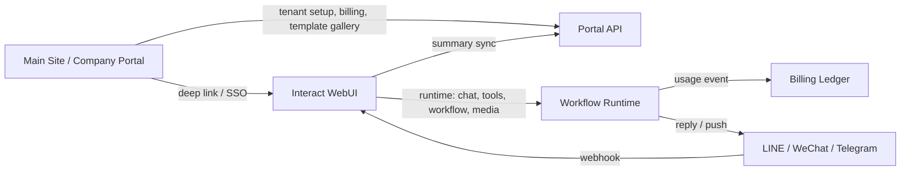
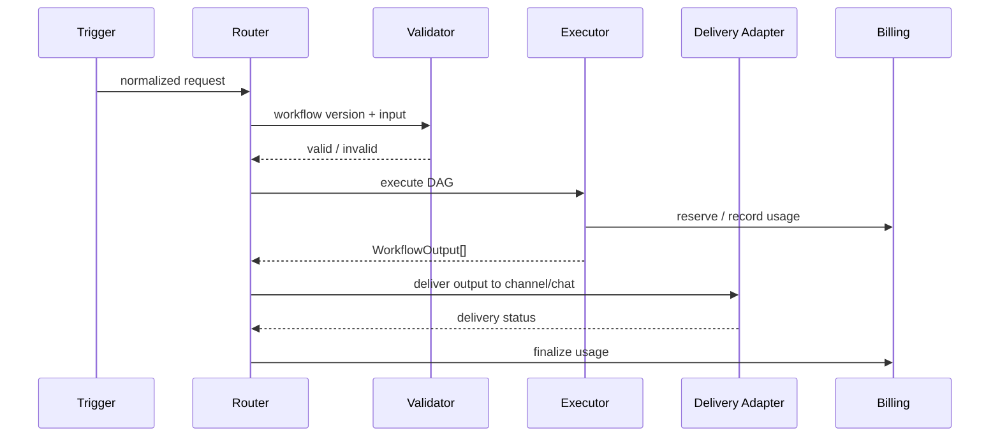

# Interact Ai Workflow + Omnichannel Development Handbook

Status: planning manual  
Primary editor choice: Svelte Flow  
Target systems: Interact Vision main site / company portal + Interact WebUI  
UX baseline: Nielsen Norman Group 10 Usability Heuristics

## 0. Executive Summary

This project should not treat workflow as a separate low-code product that users must visit, configure, and remember. Workflow should become a native capability of Interact Ai:

- Users can build workflow visually in WebUI.
- Users can publish and share workflow versions.
- Users can run workflows from WebUI chat.
- LINE, WeChat, Telegram, and future web chat can drive the same workflow runtime.
- Workflow outputs can be delivered back to the originating channel as text, image, audio, video, file, card, or handoff instruction when the platform supports it.
- The main site / company portal handles commercial, tenant, onboarding, channel setup, template discovery, billing, and governance entry points.
- WebUI handles the heavy runtime path: chat, model calls, tools, data connectors, workflow execution, channel webhooks, delivery, run logs, and token accounting.

The shortest correct product sentence is:

> Workflow is a shareable, versioned, visual toolchain that can be triggered by chat or external channels and can reply through the same channel.

## 1. Why Svelte Flow

Svelte Flow is the editor canvas, not the runtime. This is intentional.

Use Svelte Flow for:

- Node graph editing.
- Drag/drop workflow builder.
- Edge validation.
- Node selection and inspector panel.
- Run-state visualization.
- Inline debug overlays.

Do not use Svelte Flow for:

- Secret handling.
- Workflow execution authority.
- Billing.
- Channel delivery.
- Permission checks.
- Long-running jobs.

Those must stay server-side.

Reasons for this choice:

- WebUI is already Svelte/SvelteKit.
- `@xyflow/svelte` is already present in `package.json`.
- The editor can reuse WebUI stores, modals, toast, routing, permissions, and theme.
- It avoids iframe integration.
- It avoids building two separate identity/session systems.
- It keeps workflow data and execution under Interact Ai governance.
- It leaves room to import/export Langflow-like definitions later.

## 2. Product Boundary: Main Site vs WebUI

### 2.1 Main Site / Company Portal Responsibilities

The main site should be the business and governance entry point. It should not handle high-volume workflow execution directly.

Main site owns:

- Public product pages for workflows, agents, channels, and templates.
- Tenant onboarding.
- Company profile.
- Plan and billing overview.
- Seat / member / role management if already owned by the portal.
- Channel connection wizard entry points.
- Template gallery landing pages.
- Share landing pages for public workflow templates.
- Purchase / upgrade / contact sales calls to action.
- Lightweight usage dashboard summaries.
- Links into WebUI for editing and execution.

Main site should not own:

- Long-running workflow execution.
- LLM calls.
- Tool execution.
- Data connector query execution.
- Channel webhook receive path.
- Media generation.
- Channel media delivery.

Reason: LINE / WeChat / Telegram traffic should not detour through marketing/company pages. It should go straight to WebUI runtime, where existing chat, billing, tools, and channel code already live.

### 2.2 WebUI Responsibilities

WebUI owns:

- Workflow editor.
- Workflow CRUD.
- Workflow validation.
- Workflow versioning.
- Workflow execution.
- Chat-driven workflow invocation.
- Channel-driven workflow invocation.
- Channel webhook handlers.
- Channel delivery adapters.
- Run logs.
- Token and cost accounting.
- Secrets and connector binding.
- Model/tool/knowledge permission checks.
- Workflow template install/clone.

### 2.3 Integration Contract Between Main Site and WebUI

Main site should call WebUI only through explicit APIs:

- Provision company / owner account.
- Read allowed workflow templates.
- Open WebUI editor deep link.
- Display usage summary.
- Configure channel metadata if portal owns channel UI.
- Receive billing summary events.

Recommended integration pattern:



## 3. Existing WebUI Baseline

Current repo already contains important building blocks:

- `backend/open_webui/routers/interact_channels.py`
  - `line / wechat / telegram` webhook route.
  - Channel signature verification.
  - Reply modes: `ai`, `fixed`, `handoff`, `silent`.
  - Rate limits and daily token limits.
  - Token billing integration.
  - Channel context summary.
  - Current delivery mostly text-oriented.

- `backend/open_webui/models/interact_channels.py`
  - Channel table.
  - Channel event table.
  - Duplicate event protection.
  - Rate limit and daily quota claims.
  - Encrypted channel secrets.

- `backend/open_webui/main.py`
  - Chat completion runtime.
  - Metadata support, including `interact_channel`.
  - Billing hooks.

- `backend/open_webui/tools/interact_database.py`
  - Data connector tool path.
  - `pyodbc` support for MSSQL-style connectors.

- `src/lib/components/chat/MessageInput.svelte`
  - Main WebUI chat input surface.
  - Natural place to add workflow selector.

- `src/lib/components/automations/AutomationEditor.svelte`
  - Existing scheduled automation UX.
  - Useful reference for save/run/runs history patterns.

Implication:

The first workflow version should extend these existing concepts instead of creating an unrelated workflow subsystem.

## 4. Core Domain Model

### 4.1 Workflow

`workflow` is the editable draft object.

Suggested fields:

```text
id                  text primary key
owner_user_id       text not null
company_email       text nullable / tenant key
name                text not null
description         text nullable
status              text enum: draft, published, archived, broken
visibility          text enum: private, team, link, public_template
default_version_id  text nullable
graph_json          text not null
input_schema_json   text nullable
output_schema_json  text nullable
tags_json           text nullable
icon                text nullable
created_at          bigint
updated_at          bigint
```

### 4.2 Workflow Version

`workflow_version` is immutable. Channel/chat execution should use a version, not a mutable draft.

Suggested fields:

```text
id                  text primary key
workflow_id         text not null
version             integer not null
graph_json          text not null
input_schema_json   text nullable
output_schema_json  text nullable
published_by        text not null
publish_notes       text nullable
created_at          bigint
```

### 4.3 Workflow Share

Suggested fields:

```text
id                  text primary key
workflow_id         text not null
workflow_version_id text nullable
share_type          text enum: user, group, company, link, public_template
target_id           text nullable
permission          text enum: use, clone, edit
created_by          text not null
created_at          bigint
expires_at          bigint nullable
```

Rules:

- `use` lets recipients execute a workflow version.
- `clone` lets recipients copy a workflow definition into their own workspace.
- `edit` should be rare and limited to trusted team contexts.
- Public templates should default to clone, not use, unless tenant policy allows shared execution.

### 4.4 Workflow Run

Suggested fields:

```text
id                  text primary key
workflow_id         text not null
workflow_version_id text not null
trigger_type        text enum: webui_chat, line, telegram, wechat, automation, api, test
trigger_ref_json    text nullable
user_id             text nullable
company_email       text nullable
channel_type        text nullable
channel_id          text nullable
external_user_id    text nullable
status              text enum: queued, running, succeeded, failed, cancelled, waiting_handoff
input_json          text nullable
output_json         text nullable
error_json          text nullable
usage_json          text nullable
started_at          bigint
completed_at        bigint nullable
```

### 4.5 Workflow Run Step

Suggested fields:

```text
id                  text primary key
run_id              text not null
node_id             text not null
node_type           text not null
status              text enum: pending, running, succeeded, failed, skipped
input_preview_json  text nullable
output_preview_json text nullable
error_json          text nullable
usage_json          text nullable
started_at          bigint nullable
completed_at        bigint nullable
```

### 4.6 Workflow Secret Binding

Never store secret values inside `graph_json`.

Suggested fields:

```text
id                  text primary key
workflow_id         text not null
node_id             text not null
secret_type         text enum: channel, connector, oauth_tool, api_key, webhook
secret_ref          text not null
scope_type          text enum: user, company, channel
created_at          bigint
```

## 5. Canonical Message and Output Model

The most important design decision is to normalize all inputs and outputs. Chat and channel integrations should not pass raw LINE/Telegram/WeChat payloads directly into workflows.

### 5.1 Inbound Channel Envelope

Create a normalized envelope:

```ts
type ChannelEnvelope = {
  envelopeId: string;
  channelType: 'webui_chat' | 'line' | 'telegram' | 'wechat';
  channelId: string;
  channelIdentifier: string;
  externalUserId: string;
  conversationId: string;
  platformEventId: string;
  timestamp: number;
  replyMode: 'reply' | 'push' | 'passive_xml' | 'none';
  capabilities: ChannelCapabilities;
  message: ChannelMessage;
  raw?: unknown;
};
```

### 5.2 Channel Message

```ts
type ChannelMessage = {
  text?: string;
  parts: MessagePart[];
  locale?: string;
  userDisplayName?: string;
};

type MessagePart =
  | { type: 'text'; text: string }
  | { type: 'image'; fileId?: string; url?: string; mimeType?: string }
  | { type: 'audio'; fileId?: string; url?: string; mimeType?: string; durationMs?: number }
  | { type: 'video'; fileId?: string; url?: string; mimeType?: string; durationMs?: number }
  | { type: 'file'; fileId?: string; url?: string; filename?: string; mimeType?: string }
  | { type: 'location'; latitude: number; longitude: number; label?: string }
  | { type: 'postback'; data: Record<string, unknown> };
```

### 5.3 Workflow Output

Workflow runner should return an ordered list of outputs:

```ts
type WorkflowOutput =
  | { type: 'text'; text: string; markdown?: boolean }
  | { type: 'image'; fileId?: string; url?: string; alt?: string }
  | { type: 'audio'; fileId?: string; url?: string; title?: string }
  | { type: 'video'; fileId?: string; url?: string; title?: string; thumbnailUrl?: string }
  | { type: 'file'; fileId?: string; url?: string; filename: string }
  | { type: 'card'; title: string; body?: string; imageUrl?: string; actions?: OutputAction[] }
  | { type: 'handoff'; reason: string; transcriptSummary?: string }
  | { type: 'json'; value: unknown };
```

Why this matters:

- WebUI chat can render most output types.
- LINE adapter can map outputs to LINE message objects.
- Telegram adapter can map outputs to `sendMessage`, `sendPhoto`, `sendVideo`, `sendAudio`, `sendDocument`.
- WeChat adapter can map simple immediate outputs to passive XML and longer/multimedia replies to customer service messages when available.

## 6. Channel Capability Matrix

### 6.1 Current Reality

Current `interact_channels.py` has text delivery paths:

- LINE reply/push text.
- Telegram sendMessage text.
- WeChat passive XML text.

The workflow system must extend this into typed output delivery.

### 6.2 Capability Matrix

| Capability | WebUI Chat | LINE | Telegram | WeChat Official Account |
|---|---:|---:|---:|---:|
| Inbound text | yes | yes | yes | yes |
| Inbound image | planned | supported by platform, adapter needed | supported by platform, adapter needed | supported by platform, adapter needed |
| Inbound audio | planned | supported by platform, adapter needed | supported by platform, adapter needed | supported by platform, adapter needed |
| Inbound video/file | planned | supported by platform, adapter needed | supported by platform, adapter needed | supported by platform, adapter needed |
| Immediate text reply | yes | yes | yes | yes |
| Background / async text reply | yes | push | sendMessage | customer service message if allowed |
| Image reply | yes | image message | sendPhoto | passive image or customer service image with media_id |
| Audio reply | yes | audio message | sendAudio / sendVoice | voice media message with media_id |
| Video reply | yes | video message | sendVideo | video media message with media_id |
| File reply | yes | limited; often use link/card | sendDocument | limited; often use article/link/customer-service message |
| Card/template | yes | Flex / template message | inline keyboard / rich messages | article/news/template messages depending account capability |

### 6.3 Platform Notes

LINE:

- Official Messaging API supports reply, push, multicast, narrowcast, broadcast, and multiple message types.
- LINE reply/push requests can contain up to five message objects.
- Long-running workflows should reply quickly with progress text/loading, then push final output when allowed.

Telegram:

- Bot API supports HTTPS webhook with `X-Telegram-Bot-Api-Secret-Token`.
- Delivery can use separate methods for text, image, audio, video, document, and rich formats.
- Telegram is usually the easiest channel for file-style output because Bot API supports document/photo/video upload or URL sending.

WeChat:

- WeChat Official Account integration is the trickiest.
- Passive replies are time-sensitive and XML-shaped.
- Rich/multimedia replies often require media upload and `media_id`.
- Long-running workflow responses should prefer a quick passive acknowledgement plus customer service message if the account and time window allow it.
- Some capabilities depend on account type, verification state, region, and Official Account permission.

## 7. Workflow Trigger Design

### 7.1 Trigger Types

```text
webui_chat.manual
webui_chat.intent
line.message
telegram.message
wechat.message
automation.schedule
api.call
test.editor
```

### 7.2 WebUI Chat Trigger

Add a workflow selector to the main chat input:

- Button label: `Workflow`.
- Shows pinned workflows first.
- Search all usable workflows.
- Shows required inputs before send.
- Lets user include:
  - current prompt
  - selected files
  - current chat history
  - selected model
  - selected tools
  - current knowledge context

Send payload should add metadata:

```json
{
  "workflow": {
    "id": "workflow-id",
    "versionId": "version-id",
    "trigger": "webui_chat.manual",
    "includeChatContext": true
  }
}
```

### 7.3 Natural Language Trigger

Optional in phase 2:

- User says: `幫我跑合約審查`.
- Intent router checks available workflows.
- If confidence is high, suggest:
  - `要使用「合約審查」工作流嗎？`
- User confirms.
- Runner executes workflow.

Do not silently run workflows with external effects.

### 7.4 Channel Trigger

For LINE / WeChat / Telegram:

1. Receive webhook.
2. Verify signature / secret.
3. Parse raw payload.
4. Normalize to `ChannelEnvelope`.
5. Claim event idempotently.
6. Select route:
   - channel pinned workflow
   - keyword command
   - intent-selected workflow
   - default agent chat
7. Execute workflow or chat.
8. Map `WorkflowOutput[]` to platform delivery.
9. Record delivery status.
10. Record billing and run logs.

### 7.5 Channel Routing Rules

Each channel should support:

```text
default_agent_model_id
default_workflow_version_id
command_routes
intent_routes
fallback_message
handoff_mode
rate_limit
daily_token_limit
media_policy
```

Example:

```json
{
  "defaultWorkflowVersionId": "wfv_customer_support_v3",
  "commands": {
    "/quote": "wfv_sales_quote_v2",
    "/repair": "wfv_support_ticket_v4"
  },
  "intentRoutes": [
    {
      "intent": "invoice_question",
      "workflowVersionId": "wfv_invoice_lookup_v1",
      "requiresConfirmation": false
    },
    {
      "intent": "refund_request",
      "workflowVersionId": "wfv_refund_review_v2",
      "requiresConfirmation": true
    }
  ]
}
```

## 8. Workflow Editor UX

### 8.1 Pages

`/workflows`

- My workflows.
- Shared with me.
- Templates.
- Recent runs.
- Broken workflows.

`/workflows/new`

- Start from blank.
- Start from template.
- Import JSON.

`/workflows/:id/edit`

- Visual editor.
- Test panel.
- Publish/share panel.
- Version history.

`/workflows/:id/runs`

- Run list.
- Filters by trigger, status, channel, date, user.

`/workflows/:id/runs/:runId`

- Step-by-step replay.
- Inputs/outputs.
- Logs.
- Cost and token usage.

### 8.2 Editor Layout

Desktop:

```text
Top bar:
  Back | Workflow name | Draft/Saved status | Test | Publish | Share | More

Left panel:
  Node library
  Search
  Categories
  Templates/snippets

Canvas:
  Svelte Flow graph
  Mini map
  Zoom controls
  Validation badges

Right panel:
  Node inspector
  Workflow settings
  Input/output schema

Bottom drawer:
  Test input
  Run output
  Step logs
```

Mobile / narrow:

- Use tabbed layout:
  - Canvas
  - Nodes
  - Settings
  - Test
- Disable dense multi-panel layout.
- Keep publish/share in top menu.

### 8.3 Node Library Categories

Recommended first version:

```text
Inputs
  Text Input
  Chat Context
  File Input
  Channel Message

AI
  Prompt
  LLM
  Structured Output
  Image Generation
  Speech / TTS

Knowledge
  Knowledge Search
  Document Extract

Tools
  Tool Call
  Data Connector
  HTTP Request

Logic
  Condition
  Switch
  Merge
  Transform

Outputs
  Text Reply
  Image Reply
  File Reply
  Channel Reply
  Handoff
```

### 8.4 MVP Node Specs

#### Input Node

Purpose:

- Defines workflow inputs.

Fields:

- input key
- type: text, file, image, audio, json
- required
- default value
- description

Validation:

- workflow must have at least one input node or implicit channel/chat input.

#### Prompt Node

Purpose:

- Builds prompt text from variables.

Fields:

- system or user prompt template
- variable picker
- output format hint

Validation:

- missing variables warn before publish.

#### LLM Node

Purpose:

- Calls a model through existing Open WebUI model routing.

Fields:

- model id
- fallback model id
- temperature
- max tokens
- function calling mode
- tools/skills/filter ids

Validation:

- current user/channel must have model permission.
- if tools are selected, current user/channel must have tool permission.

#### Tool Call Node

Purpose:

- Calls existing Open WebUI tools.

Fields:

- tool id
- input mapping
- output mapping
- timeout

Validation:

- tool permission.
- required fields mapped.

#### Data Connector Node

Purpose:

- Query authorized business data.

Fields:

- connector id
- query mode: natural language, SQL template, schema lookup
- row limit
- safe mode

Validation:

- connector is active.
- user/channel has connector permission.
- SQL safety checks.

#### Condition Node

Purpose:

- Routes execution based on expression.

Fields:

- expression builder
- branches

Validation:

- every branch target valid.
- expression type safe.

#### Transform Node

Purpose:

- Convert JSON/text into another shape.

Fields:

- JSONPath / JMESPath-like selector
- template
- strict schema toggle

Validation:

- no arbitrary unsafe JS in MVP.

#### Output Node

Purpose:

- Defines what gets returned to WebUI chat or external channel.

Fields:

- output type
- mapping from previous node
- fallback text
- channel compatibility policy:
  - degrade to text
  - send as link
  - fail validation

Validation:

- at least one output node required.

## 9. Workflow Runtime

### 9.1 Runtime Stages



### 9.2 Execution Rules

- Execute immutable `workflow_version`.
- Validate before run.
- Record every run.
- Record every node status.
- Support cancellation.
- Support timeouts.
- Enforce max nodes per workflow.
- Enforce max run duration.
- Enforce max concurrent runs per user/company/channel.
- Enforce model/tool/data connector permissions at run time, not only at publish time.

### 9.3 DAG Constraints for MVP

MVP should not support arbitrary loops.

Allowed:

- Directed acyclic graph.
- Branching.
- Merging.
- Parallel independent branches if safe.

Not in MVP:

- While loops.
- Agentic self-modifying graph.
- Infinite retries.
- Unbounded recursive tool calls.

### 9.4 Error Semantics

Each node has:

```text
status
started_at
completed_at
input_preview
output_preview
error_code
error_message
retryable
```

Workflow-level failure rules:

- Required node failure fails run.
- Optional node failure may skip downstream optional branches.
- Output node failure means delivery failure, not necessarily workflow failure.
- Channel delivery failure must be recorded separately.

## 10. Channel Delivery Layer

### 10.1 Required New Module

Create:

```text
backend/open_webui/channels/
  __init__.py
  base.py
  line.py
  telegram.py
  wechat.py
  renderer.py
```

Or, if keeping closer to current structure:

```text
backend/open_webui/utils/channel_delivery.py
backend/open_webui/utils/channel_renderers.py
```

Preferred long-term structure is `channels/`.

### 10.2 Base Interfaces

```python
class ChannelCapabilities(BaseModel):
    text: bool = True
    image: bool = False
    audio: bool = False
    video: bool = False
    file: bool = False
    card: bool = False
    async_push: bool = False
    max_text_chars: int | None = None
    max_messages_per_reply: int | None = None

class DeliveryResult(BaseModel):
    ok: bool
    delivered: list[dict] = []
    degraded: list[dict] = []
    error: str | None = None

class ChannelDeliveryAdapter(Protocol):
    async def deliver(
        self,
        channel: InteractChannelModel,
        target: ChannelTarget,
        outputs: list[WorkflowOutput],
        mode: DeliveryMode,
    ) -> DeliveryResult:
        ...
```

### 10.3 Rendering Strategy

Renderer decides how to degrade unsupported outputs.

Examples:

- If Telegram output is image: send photo.
- If LINE output is image: send image message with HTTPS image URL.
- If WeChat passive reply cannot send generated image immediately: send text acknowledgement and queue customer-service image if possible.
- If platform cannot send file: send secure download link.
- If output contains more than platform max message count: summarize and attach link.

### 10.4 Media Storage

All generated media must be stored before channel delivery.

Requirements:

- Public HTTPS URL or signed URL.
- MIME type.
- file size.
- expiration policy.
- thumbnail URL for video where needed.
- audit owner.

Suggested table:

```text
workflow_media
  id
  run_id
  node_id
  type
  file_id
  public_url
  mime_type
  size_bytes
  expires_at
  created_at
```

### 10.5 LINE Delivery

Needed additions:

- `_line_output_messages(outputs) -> list[dict]`
- support text/image/video/audio/flex/link degradation
- split into chunks respecting LINE limits
- reply path for immediate output
- push path for background output
- delivery status per message

For long-running workflows:

1. Reply quickly with progress/acknowledgement.
2. Run workflow in background.
3. Push final outputs.

### 10.6 Telegram Delivery

Needed additions:

- send text via `sendMessage`
- send image via `sendPhoto`
- send video via `sendVideo`
- send audio via `sendAudio` or `sendVoice`
- send file via `sendDocument`
- optional inline keyboard for cards/actions

Telegram should be the reference implementation for rich delivery because it has straightforward Bot API methods.

### 10.7 WeChat Delivery

Needed additions:

- Parse inbound non-text messages.
- Passive text reply for quick responses.
- Passive media reply when media_id is already available.
- Customer service message support for async/rich output when account capability allows.
- Temporary media upload for generated media.
- Safe fallback to text + link when media flow is unavailable.

Important product rule:

WeChat workflow UX must be designed as "best effort rich delivery". The UI should not promise the exact same output capability as WebUI chat or Telegram unless the connected Official Account has verified capabilities.

## 11. Sharing and Versioning

### 11.1 Draft vs Published

- Draft can change any time.
- Published version is immutable.
- Chat/channel should execute published version by default.
- Editor test can execute draft.

### 11.2 Share Modes

Private:

- Owner only.

Team:

- Company/group members can use or clone.

Link:

- Anyone with link can preview.
- Execution requires login or channel binding.

Public template:

- Listed in template gallery.
- Users clone into their workspace.

### 11.3 Secret Handling in Shared Workflows

When cloning:

- Copy graph.
- Copy node configuration.
- Do not copy secret binding values.
- Mark nodes requiring secrets as `Needs setup`.

When using shared workflow directly:

- Run under executor's permissions.
- Use executor/company/channel secret bindings.
- If missing secret, fail before execution with clear remediation.

## 12. Permission Model

Required permission checks:

- Can view workflow.
- Can edit workflow.
- Can publish workflow.
- Can share workflow.
- Can run workflow.
- Can use model.
- Can use tool.
- Can use knowledge base.
- Can use data connector.
- Can use channel.
- Can deliver media.

Recommended permission keys:

```ts
permissions.features.workflows
permissions.workspace.workflows.create
permissions.workspace.workflows.publish
permissions.workspace.workflows.share
permissions.workspace.workflows.run
permissions.channels.workflow_triggers
permissions.channels.media_delivery
```

Channel-specific execution:

- Channel should have a service identity.
- That service identity should resolve to company/user policy.
- Do not treat anonymous external user as WebUI admin.

## 13. Billing and Quotas

Workflow run cost should include:

- LLM prompt/completion tokens.
- Context summary tokens.
- Tool calls if billable.
- Data connector usage if billable.
- Image generation.
- Audio generation / transcription.
- File extraction / OCR if billable.
- Channel push cost if platform cost exists or if internal plan counts it.

Billing lifecycle:

1. Estimate run reservation.
2. Check channel/user/company quota.
3. Execute.
4. Record actual usage.
5. Commit usage.
6. Release unused reservation or mark overage.

For external channels:

- Maintain current per-minute and daily-user limits.
- Add media limits:
  - max images/day
  - max audio minutes/day
  - max file size
  - max workflow runs/day

## 14. Main Site Features to Build

### 14.1 Public Workflow Product Page

Purpose:

- Explain workflow capability.
- Show use cases.
- Link to demo/contact.

Must include:

- "Build once, run from WebUI / LINE / WeChat / Telegram".
- Security and governance explanation.
- Template examples.
- Commercial CTA.

### 14.2 Template Gallery Landing

Main site can show public templates:

- Customer support workflow.
- Contract review workflow.
- Sales quote workflow.
- Internal knowledge assistant workflow.
- Data lookup workflow.
- Multichannel FAQ workflow.

Each template page:

- Preview diagram.
- Inputs.
- Outputs.
- Supported channels.
- Required connectors/secrets.
- "Use in WebUI" button.

### 14.3 Channel Setup Entry

For company users:

- Show channel cards:
  - LINE
  - WeChat
  - Telegram
  - Web chat
- Each card shows setup status:
  - Not connected
  - Connected
  - Webhook verified
  - Needs token
  - Error

Deep link to WebUI channel settings for actual secret entry unless portal already owns encrypted secret storage.

### 14.4 Usage and Billing Summary

Main site should show summaries only:

- workflow runs this month
- messages by channel
- token usage
- media generation count
- failures
- top workflows

Detailed logs stay in WebUI.

## 15. WebUI Features to Build

### 15.1 Backend

Create:

```text
backend/open_webui/models/workflows.py
backend/open_webui/routers/workflows.py
backend/open_webui/utils/workflow_validation.py
backend/open_webui/utils/workflow_runtime.py
backend/open_webui/utils/workflow_nodes/
backend/open_webui/channels/
```

Register router in:

```text
backend/open_webui/main.py
```

### 15.2 Frontend

Create:

```text
src/lib/apis/workflows/index.ts
src/lib/components/workflows/WorkflowEditor.svelte
src/lib/components/workflows/WorkflowCanvas.svelte
src/lib/components/workflows/NodePalette.svelte
src/lib/components/workflows/NodeInspector.svelte
src/lib/components/workflows/TestRunPanel.svelte
src/lib/components/workflows/RunLogPanel.svelte
src/lib/components/workflows/ShareWorkflowModal.svelte
src/lib/components/workflows/WorkflowPicker.svelte
src/routes/(app)/workflows/+page.svelte
src/routes/(app)/workflows/[id]/edit/+page.svelte
src/routes/(app)/workflows/[id]/runs/+page.svelte
```

Modify:

```text
src/lib/components/chat/MessageInput.svelte
src/lib/components/chat/MessageInput/IntegrationsMenu.svelte
src/lib/constants/permissions.ts
src/lib/i18n/locales/*/translation.json
```

### 15.3 Channel UI

Extend existing channel settings:

- Default workflow.
- Command routes.
- Intent routes.
- Media output policy.
- Long-running reply behavior.
- Handoff destination.
- Test webhook.
- Test workflow from channel persona.

## 16. API Design

### 16.1 Workflow CRUD

```text
GET    /api/v1/workflows
POST   /api/v1/workflows
GET    /api/v1/workflows/{id}
POST   /api/v1/workflows/{id}/update
POST   /api/v1/workflows/{id}/delete
```

### 16.2 Validation and Publishing

```text
POST   /api/v1/workflows/{id}/validate
POST   /api/v1/workflows/{id}/publish
GET    /api/v1/workflows/{id}/versions
POST   /api/v1/workflows/{id}/rollback
```

### 16.3 Run

```text
POST   /api/v1/workflows/{id}/run
POST   /api/v1/workflows/versions/{version_id}/run
GET    /api/v1/workflows/runs/{run_id}
GET    /api/v1/workflows/runs/{run_id}/events
POST   /api/v1/workflows/runs/{run_id}/cancel
```

### 16.4 Sharing

```text
POST   /api/v1/workflows/{id}/share
GET    /api/v1/workflows/{id}/shares
POST   /api/v1/workflows/{id}/clone
GET    /api/v1/workflows/templates
```

### 16.5 Channel Routing

```text
GET    /api/v1/interact/channels/{id}/workflow-routes
POST   /api/v1/interact/channels/{id}/workflow-routes/update
POST   /api/v1/interact/channels/{id}/test-workflow
```

## 17. UX Design Using NN/g 10 Heuristics

This section is not abstract. Each heuristic maps to required UI behavior.

### 17.1 Visibility of System Status

Required:

- Save status in editor top bar: `Unsaved`, `Saving`, `Saved`, `Save failed`.
- Validation status: `Ready to publish`, `3 issues`, `Broken`.
- Run status on canvas:
  - pending gray
  - running blue pulse
  - success green
  - failed red
  - skipped muted
- Channel delivery status:
  - `Sent to LINE`
  - `Telegram delivery failed`
  - `WeChat replied as text because image delivery is unavailable`
- Async workflow in channel must send acknowledgement when execution may exceed platform reply window.

Acceptance criteria:

- A user can tell whether the workflow is saved, valid, running, failed, or delivered without opening logs.

### 17.2 Match Between System and Real World

Required terminology:

- Use `Ask AI`, not `LLM invocation`.
- Use `Check knowledge base`, not `retriever node`.
- Use `Send reply`, not `output serializer`.
- Use `Customer channel`, not `external adapter`.
- Use `Needs setup`, not `unbound secret`.

Acceptance criteria:

- Non-engineering users can understand node names without reading documentation.

### 17.3 User Control and Freedom

Required:

- Undo / redo in editor.
- Duplicate node.
- Delete with undo toast.
- Cancel run.
- Roll back published version.
- Leave editor with unsaved-change confirmation.
- Disable workflow without deleting it.
- Channel route can be reverted to previous workflow version.

Acceptance criteria:

- Accidental delete, publish, route change, or run can be recovered or cancelled.

### 17.4 Consistency and Standards

Required:

- Use existing WebUI button, modal, toast, dropdown, switch, and sidebar patterns.
- Use the same permission language as tools, automations, knowledge, and channels.
- Use the same run history pattern as automations where possible.
- Use common channel terms from LINE/Telegram/WeChat setup pages.

Acceptance criteria:

- Workflow pages feel like WebUI, not a bolted-on product.

### 17.5 Error Prevention

Required:

- Prevent incompatible edge connections.
- Validate before publish.
- Validate before assigning workflow to channel.
- Warn when workflow output is unsupported by selected channel.
- Require fallback text for channel workflows.
- Require model/tool/data connector permissions before publish.
- Show media size/format warnings before publish.
- Do not allow workflows with missing secret bindings to be activated.

Acceptance criteria:

- Most broken workflows are caught before users or customers trigger them.

### 17.6 Recognition Rather than Recall

Required:

- Node palette search.
- Node categories.
- Port labels.
- Variable picker.
- Recent workflows in chat selector.
- Pinned workflows.
- Channel capability badges.
- Inline examples for each node type.

Acceptance criteria:

- Users do not need to memorize variable names, node IDs, or channel limitations.

### 17.7 Flexibility and Efficiency of Use

Required:

- Templates for novice users.
- Keyboard shortcuts for power users.
- Copy/paste nodes.
- Quick add node from edge.
- Slash command in chat, e.g. `/workflow`.
- Pin workflow to chat input.
- Channel command routes, e.g. `/quote`.

Acceptance criteria:

- A beginner can start from template; an expert can build quickly without mouse-heavy friction.

### 17.8 Aesthetic and Minimalist Design

Required:

- Canvas nodes show only primary label, status, and key setting summary.
- Advanced parameters collapsed.
- Run logs hidden in bottom drawer.
- Avoid long instructional text on canvas.
- Empty state offers 3 useful templates, not paragraphs.

Acceptance criteria:

- Editor remains scannable with 20+ nodes.

### 17.9 Help Users Recognize, Diagnose, and Recover From Errors

Required:

- Error shown on the failing node.
- Error includes:
  - what happened
  - why it matters
  - how to fix it
- Examples:
  - `Missing model permission. Choose another model or ask admin for access.`
  - `LINE cannot receive this file directly. Send as secure link instead.`
  - `Data connector secret is not configured. Open node settings to bind a connector.`
- Retry failed node when safe.
- Re-run from failed node in editor test mode.

Acceptance criteria:

- A user can resolve common workflow errors without opening server logs.

### 17.10 Help and Documentation

Required:

- Contextual help for every node.
- "Why can't I publish?" checklist.
- Channel capability docs.
- Template setup checklist.
- First-run guided tour.
- Inline link to run logs.

Acceptance criteria:

- Help is task-based, searchable, and close to the point of failure.

## 18. Workflow Examples

### 18.1 WebUI Chat: Contract Review

Flow:

```text
File Input
  -> Document Extract
  -> LLM: Clause Extraction
  -> LLM: Risk Review
  -> Output: Summary + Risk Table + Reply Draft
```

User experience:

- User uploads contract in chat.
- Selects `Contract Review` workflow.
- Result appears in same chat.

### 18.2 LINE: Customer Support

Flow:

```text
Channel Message
  -> Knowledge Search
  -> Condition: confidence high?
    -> LLM Reply
    -> Handoff
  -> Channel Reply
```

Delivery:

- Quick text reply for normal answers.
- If long-running, reply with acknowledgement, then push final answer.
- If handoff, send human support message and mark run as `waiting_handoff`.

### 18.3 Telegram: Multimedia Report

Flow:

```text
Text Input
  -> Data Connector Query
  -> Chart/Image Generation
  -> LLM Summary
  -> Output: Text + Image + CSV File
```

Delivery:

- `sendMessage` for summary.
- `sendPhoto` for chart.
- `sendDocument` for CSV.

### 18.4 WeChat: Lead Qualification

Flow:

```text
WeChat Message
  -> LLM: classify intent
  -> Condition
  -> CRM/Data Connector
  -> Text Reply
  -> Optional customer service follow-up
```

Delivery:

- Passive XML text reply immediately.
- For generated documents or images, use customer service message if available.
- Otherwise send a secure link.

## 19. Development Phases

### Phase 0: Hardening Existing Channel Text Path

Goal:

- Make current channel text path reliable before adding workflow and media.

Tasks:

- Fix mojibake fallback strings in `interact_channels.py`.
- Extract channel delivery functions from router into adapter module.
- Add typed `ChannelEnvelope`.
- Add typed `WorkflowOutput`.
- Add tests for LINE/Telegram/WeChat text delivery.
- Add delivery status and error classification.

Done when:

- Existing LINE/Telegram/WeChat text chat still passes tests.
- Delivery code is not buried inside route handler.

### Phase 1: Workflow MVP in WebUI

Goal:

- Build and run simple workflows from WebUI.

Tasks:

- Add workflow DB models.
- Add workflow router.
- Add Svelte Flow editor.
- Add nodes:
  - Input
  - Prompt
  - LLM
  - Tool Call
  - Output
- Add validation.
- Add test run panel.
- Add run logs.
- Add publish version.

Done when:

- User can create workflow, test it, publish it, and see run logs.

### Phase 2: WebUI Chat Workflow Invocation

Goal:

- Run workflows directly from the main chat UI.

Tasks:

- Add workflow picker in `MessageInput.svelte`.
- Add workflow metadata to chat completion payload.
- Add backend route to execute workflow and stream/run result.
- Render workflow status in chat.
- Allow pinned workflows.

Done when:

- User can select a published workflow in chat and receive output in the chat thread.

### Phase 3: Channel Workflow Routing

Goal:

- LINE/Telegram/WeChat can trigger workflows.

Tasks:

- Add channel workflow route config.
- Add command routes.
- Add default workflow per channel.
- Add intent routing optional.
- Modify `interact_channels.py` to call workflow runner before default chat.
- Add channel run logs.

Done when:

- A LINE/Telegram/WeChat text message can trigger a workflow and receive text output.

### Phase 4: Multimedia Output

Goal:

- Workflow can produce and deliver media.

Tasks:

- Add `WorkflowOutput[]` renderer.
- Add media storage layer.
- Extend LINE delivery for image/video/audio/link fallback.
- Extend Telegram delivery for photo/video/audio/document.
- Extend WeChat media upload/customer service delivery where available.
- Add channel compatibility validation in editor.

Done when:

- A workflow can generate an image and return it to WebUI chat, LINE, Telegram, and WeChat with channel-appropriate degradation.

### Phase 5: Sharing and Template Gallery

Goal:

- Workflows become reusable assets.

Tasks:

- Add share links.
- Add team sharing.
- Add clone template.
- Add public template gallery.
- Add main site template landing pages.
- Add install/use in WebUI deep links.

Done when:

- A user can publish a workflow template and another user can clone or use it.

### Phase 6: Governance and Enterprise Readiness

Goal:

- Make it safe for real customers.

Tasks:

- Add audit logs.
- Add approval flow for public templates.
- Add workflow policy controls.
- Add channel-level media policy.
- Add spend limits.
- Add run retention settings.
- Add export/import.
- Add monitoring dashboard.

Done when:

- Admin can explain who ran what, through which channel, with which model/tool/connector, and how much it cost.

## 20. Testing Plan

### 20.1 Backend Unit Tests

Add tests for:

- workflow validation
- graph cycle detection
- missing output node
- missing secret binding
- model permission failure
- tool permission failure
- data connector permission failure
- run success path
- run node failure path
- billing reservation/commit
- channel routing to workflow
- duplicate webhook event
- media output degradation

### 20.2 Frontend Tests

Add tests for:

- create workflow
- drag node to canvas
- connect compatible ports
- block incompatible ports
- edit node settings
- save draft
- validate and publish
- run test
- share modal
- workflow picker in chat

### 20.3 Integration Tests

Add simulated webhook tests:

- LINE text -> workflow -> text reply
- LINE text -> long workflow -> ack + push
- Telegram text -> workflow -> message + image
- WeChat text -> workflow -> passive reply
- WeChat text -> long workflow -> passive ack + customer service follow-up if configured

### 20.4 Manual QA Scenarios

Required QA scripts:

- First-time user creates workflow from template.
- Admin configures LINE channel default workflow.
- External LINE user triggers workflow.
- Telegram user receives image output.
- WeChat user receives safe text fallback for unsupported media.
- Shared workflow clone requires connector setup.
- Broken workflow cannot be assigned to channel.
- Disabled workflow stops channel route.

## 21. Observability

Add metrics:

```text
workflow_runs_total
workflow_run_duration_seconds
workflow_node_failures_total
workflow_channel_delivery_failures_total
workflow_media_outputs_total
workflow_billing_tokens_total
workflow_trigger_total{trigger_type}
```

Add logs:

- run_id
- workflow_version_id
- trigger_type
- channel_id
- external_user_id hash
- node_id
- delivery adapter
- error code

Privacy rule:

- Do not log full user messages by default.
- Store previews with truncation and permission checks.

## 22. Security Requirements

Required:

- Verify every channel webhook signature/secret.
- Idempotency for webhook events.
- No secrets in graph JSON.
- Runtime permission checks.
- File/media scanning if available.
- Signed URLs for file fallback.
- SSRF protection for HTTP Request node.
- Domain allowlist for HTTP Request node in MVP.
- SQL safety checks for Data Connector node.
- Per-node timeout.
- Per-run max cost.
- Per-channel rate limit.

High-risk nodes:

- HTTP Request
- Data Connector
- Tool Call
- Code/Transform if arbitrary execution is added later

MVP should not include arbitrary code execution in workflow nodes.

## 23. Implementation Checklist

Backend:

- [ ] Add workflow models.
- [ ] Add migrations.
- [ ] Add workflow API.
- [ ] Add workflow validation.
- [ ] Add workflow runtime.
- [ ] Add run logs.
- [ ] Add channel envelope abstraction.
- [ ] Extract channel delivery adapters.
- [ ] Add multimedia output model.
- [ ] Add media storage.
- [ ] Add billing integration.
- [ ] Add tests.

Frontend:

- [ ] Add workflow API client.
- [ ] Add workflow list page.
- [ ] Add editor page.
- [ ] Add node palette.
- [ ] Add node inspector.
- [ ] Add validation panel.
- [ ] Add test run panel.
- [ ] Add publish modal.
- [ ] Add share modal.
- [ ] Add workflow picker in chat.
- [ ] Add channel workflow settings UI.
- [ ] Add i18n keys.

Main site:

- [ ] Add workflow product page.
- [ ] Add template gallery landing page.
- [ ] Add template detail pages.
- [ ] Add channel setup entry page.
- [ ] Add usage summary widget.
- [ ] Add WebUI deep links.
- [ ] Add commercial CTA.

Operations:

- [ ] Add env vars.
- [ ] Add monitoring.
- [ ] Add deployment notes.
- [ ] Add rollback plan.
- [ ] Add data retention policy.

## 24. Open Decisions

Need product decision:

- Should channel default route be "workflow first" or "agent chat first"?
- Should public templates be clone-only at launch?
- Should workflow execution support streaming output in WebUI chat MVP?
- Which object storage should hold media output?
- Should WeChat support customer-service media delivery in phase 4 or use text/link fallback first?
- Should main site own channel setup UI, or should all channel secrets remain in WebUI?
- Should workflow sharing be user-level first or company/group-level first?

Recommended answers for MVP:

- Default route: agent chat first, workflow only when explicitly selected or channel configured.
- Public templates: clone-only.
- Streaming: text streaming in WebUI chat optional; non-streaming is acceptable for MVP.
- Media storage: reuse existing file storage first.
- WeChat: text/link fallback first, customer-service rich delivery second.
- Channel secrets: keep in WebUI.
- Sharing: user + company/group first, public later.

## 25. Feasibility Audit Against Current Codebase

This audit is based on the current WebUI repository after the Open WebUI v0.10.2 merge.

### 25.1 Already Present

Editor foundation:

- `@xyflow/svelte` is already in `package.json`.
- Existing SvelteKit app structure supports adding `/workflows` routes.
- Existing chat input already has integration menu patterns that can host workflow selection.

Channel foundation:

- `backend/open_webui/routers/interact_channels.py` already accepts `line`, `wechat`, and `telegram` webhook routes.
- LINE signature verification is present.
- Telegram webhook secret header verification is present.
- WeChat signature verification and passive XML response are present.
- Duplicate event protection exists via `InteractChannelEvent`.
- Channel rate limiting and daily token limit logic exist.
- Billing integration exists through `InteractBillingClient`.
- Channel metadata already flows into chat metadata as `interact_channel`.

Runtime foundation:

- Chat completion can already be called from channel code through `channel_chat`.
- Model/tool/filter resolution patterns already exist in automations and channel code.
- Data connector tooling exists in `interact_database.py`.
- Image generation and image billing paths exist in `routers/images.py`.

UI foundation:

- Automation editor already demonstrates save/run/history patterns.
- Chat components already support tools, skills, files, terminals, and other advanced input controls.
- Admin/workspace structure can host workflow permissions and workflow pages.

### 25.2 Missing but Straightforward

Workflow data:

- New workflow tables.
- New workflow router.
- New workflow API client.
- New workflow pages.

Workflow editor:

- Svelte Flow canvas component.
- Node palette.
- Node inspector.
- Validation panel.
- Test run panel.

Workflow runtime:

- DAG validation.
- Node execution registry.
- Run and step logs.
- Output normalization.

Channel integration:

- Channel route config for default workflow and command routes.
- Adapter extraction from `interact_channels.py`.
- Channel output renderer.
- Media delivery support.

### 25.3 High-Risk / Needs Care

WeChat:

- Exact media delivery depends on Official Account capabilities.
- Customer-service messages and media upload should be validated against the actual account.
- MVP should start with text/link fallback.

Media:

- LINE requires channel-compatible media URLs and message objects.
- Telegram is easiest but still needs file size and MIME checks.
- Generated files need stable HTTPS access or signed URLs.

Security:

- HTTP Request node must have SSRF protection and allowlist.
- Data Connector node must enforce SQL safety and connector permissions.
- Shared workflows must never carry secret values.

Billing:

- Multi-node workflow can use several billable services in one run.
- Billing should reserve before run and commit actual usage after run.
- Media generation can be more expensive than text tokens and needs separate limits.

UX:

- Workflow editor can become visually overwhelming quickly.
- MVP must keep advanced settings collapsed and enforce validation before publish.

### 25.4 Feasible MVP Definition

The feasible MVP is:

- WebUI workflow CRUD.
- Svelte Flow editor.
- Input / Prompt / LLM / Tool / Output nodes.
- Draft test run.
- Publish immutable version.
- Chat workflow picker.
- LINE/Telegram/WeChat text trigger to workflow.
- Text output delivery back to originating channel.
- Run logs and billing records.

Do not include in MVP:

- Arbitrary code node.
- Loop node.
- Public marketplace.
- Full WeChat rich media.
- Multi-tenant workflow approval queue.
- Automatic workflow intent routing without confirmation.

### 25.5 Feasible Multimedia V1

After text workflow trigger works, add:

- Image output in WebUI chat.
- Telegram image/file output.
- LINE image output via HTTPS image URL.
- WeChat text + secure link fallback.

Then add:

- LINE audio/video.
- Telegram audio/video.
- WeChat media upload/customer-service messages if account supports it.

## 26. Source Notes

References used for product and platform constraints:

- Nielsen Norman Group, "10 Usability Heuristics for User Interface Design": https://www.nngroup.com/articles/ten-usability-heuristics/
- Svelte Flow documentation: https://svelteflow.dev/
- xyflow MIT license: https://github.com/xyflow/xyflow/blob/main/LICENSE
- LINE Developers Messaging API send-message guide: https://developers.line.biz/en/docs/messaging-api/sending-messages/
- LINE Developers Messaging API reference: https://developers.line.biz/en/reference/messaging-api/
- Telegram Bot API: https://core.telegram.org/bots/api
- WeChat Official Account developer documentation should be used during implementation for exact XML/media/customer-service API shapes: https://developers.weixin.qq.com/doc/offiaccount/Getting_Started/Overview.html
- WeChat capability differs by account type, verification state, region, and granted Official Account permissions; implementation must be verified against the actual target Official Account before launch.
